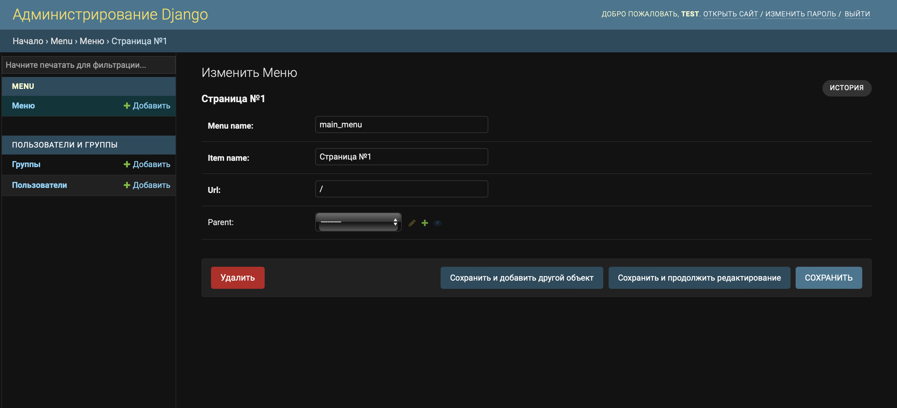
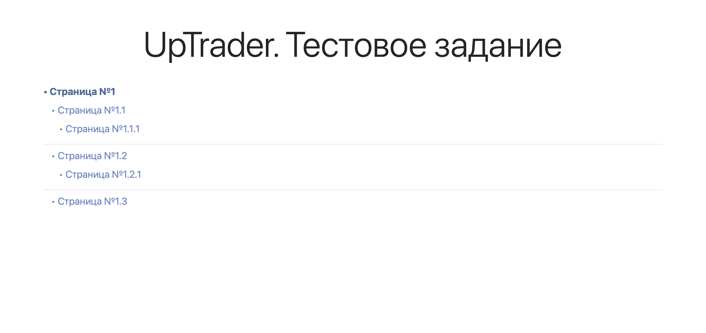
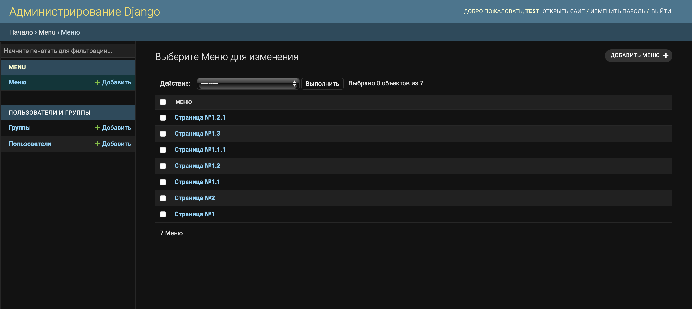

# Тестовое задание

В сервисе реализовано вложенное меню. Активная страница подсвечивается другим цветом.

### Установка

Все необходимые миграции выполнены предварительно.

```
- sudo docker-compose build
- sudo docker-compose up
```

### Как добавить меню?
В Django Admin Panel необходимо добавить меню таким образом: <br/>


Данные для входа в Django Admin Panel: <br/>
Логин: `test` <br/>
Пароль: `test`

### Как выглядит сервис?
* 
* 
* 